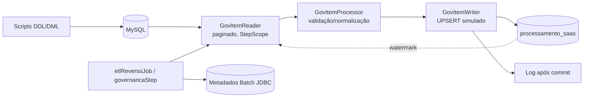
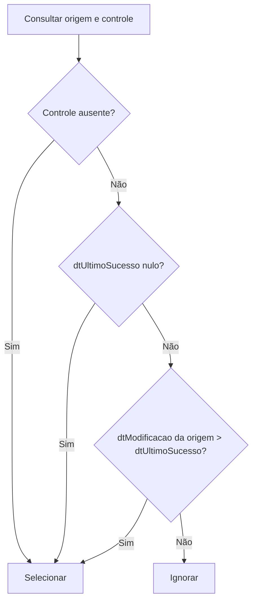
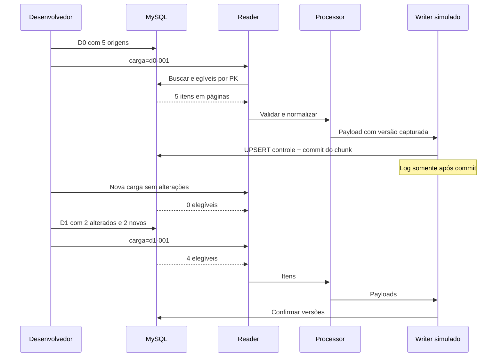

# ETL Reverso — Simulação Incremental

POC local que simula um pipeline de ingestão reversa (governança → SaaS) com leitura paginada incremental, processamento com validação de contrato e escrita idempotente com controle transacional.

**Stack:** Java 21 · Spring Boot 4.1.1 · Spring Batch 6.0.5 · MySQL 8.4

> Não há BigQuery, framework de ingestão real nem chamadas HTTP externas. O writer **simula** o sucesso de um SaaS consumidor, registrando log e controle transacional local.

Resultados da verificação desta implementação: [docs/VALIDACAO.md](docs/VALIDACAO.md)

---

## Sumário

- [Pré-requisitos](#pré-requisitos)
- [Execução rápida](#execução-rápida)
- [Arquitetura e componentes](#arquitetura-e-componentes)
- [Regra incremental e datas](#regra-incremental-e-datas)
- [Transações, repetição e retomada](#transações-repetição-e-retomada)
- [Testes](#testes)
- [Volume e observabilidade](#volume-e-observabilidade)
- [Limpeza e reset do ambiente](#limpeza-e-reset-do-ambiente)
- [Governança de schema](#governança-de-schema)
- [Melhorias futuras](#melhorias-futuras)

---

## Pré-requisitos

| Requisito | Detalhe |
|---|---|
| JDK 21 | `JAVA_HOME` configurado |
| Docker + Compose | ativo e acessível |
| Maven Wrapper | baixa distribuição/dependências na primeira execução — não requer Maven instalado |

Todos os comandos abaixo assumem execução a partir da **raiz do projeto**.

---

## Execução rápida

### Windows (PowerShell)

```powershell
docker compose up -d --wait
.\mvnw.cmd verify

.\scripts\sql.ps1 D0
java -jar target/etl-reverso-0.0.1-SNAPSHOT.jar carga=d0-001
java -jar target/etl-reverso-0.0.1-SNAPSHOT.jar carga=d0-repeticao-001

.\scripts\sql.ps1 D1
java -jar target/etl-reverso-0.0.1-SNAPSHOT.jar carga=d1-001
.\scripts\sql.ps1 Repeat
java -jar target/etl-reverso-0.0.1-SNAPSHOT.jar carga=d1-repeticao-001

.\scripts\sql.ps1 Validate
```

### Linux/macOS (Bash)

```bash
./mvnw verify

docker compose exec -T mysql mysql -ubatch -pbatch etl_reverso \
  < src/main/resources/mysql/dml/01-d0.sql
```

> Não existe ainda um runner `.sh` equivalente ao `sql.ps1` — a chamada acima precisa ser repetida manualmente para cada arquivo `.sql` da sequência de cenário (ver [Melhorias futuras](#melhorias-futuras)).

### Resultado esperado do cenário pequeno

| Execução | readCount / writeCount |
|---|---|
| D0 (carga inicial) | 5 / 5 |
| D0 repetição (sem mudanças) | 0 / 0 |
| D1 (misto: novos + alterados) | 4 / 4 |
| D1 repetição (sem mudanças) | 0 / 0 |

Ao final: **7 registros** na origem e no controle. Serviços `002` e `004` têm **duas** tentativas confirmadas; os demais, uma. As únicas origens lidas no D1 misto são `002`, `004`, `006` e `007`.

### Configuração de conexão

| Variável | Padrão | Observação |
|---|---|---|
| `DB_URL` | `jdbc:mysql://localhost:3306/etl_reverso` | ajustar se `MYSQL_PORT` for customizado |
| `DB_USER` | `batch` | exclusivo desta simulação |
| `DB_PASSWORD` | `batch` | exclusivo desta simulação |
| `MYSQL_PORT` | `3306` | definir **antes** de subir o Compose |

Não há fallback H2, nem inicialização automática de Docker pela aplicação Java — o Compose precisa estar de pé antes do `.jar` rodar.

`docker compose up` sobe **somente o MySQL** e aplica o DDL de negócio automaticamente em volume novo. A aplicação também aplica o mesmo DDL de forma idempotente na inicialização, permitindo apontar para um MySQL vazio fora do Compose. O Spring Boot inicializa os metadados do Batch (tabelas `BATCH_*`) ao subir.

> A POC usa inicialização SQL simples, **não** um mecanismo de migração versionada (Flyway/Liquibase). Alterações futuras de schema exigem migração explícita — ver [Melhorias futuras](#melhorias-futuras).

D0/D1 **nunca** são carregados automaticamente pela aplicação; são aplicados manualmente via scripts SQL antes de cada execução do job.

---

## Arquitetura e componentes



### `config/EtlReversoConfiguration`

Define o `Job`, o `Step` e os beans do pipeline; valida o parâmetro `carga` via `EtlReversoJobParametersValidator`. Deixa o Spring Boot configurar o repositório JDBC, o `DataSource` único e o `PlatformTransactionManager`.

> **Atenção:** `ServicoGovernancaItemReader` implementa `StepExecutionListener` para emitir o log de resumo (`SIMULACAO_RESUMO`) ao final do step. Isso exige `.listener(reader)` explícito no `StepBuilder` — `.reader(reader)` sozinho registra a instância apenas como `ItemStream` (necessário para o `saveState`/checkpoint), não como listener de step. Sem essa linha, o log de resumo nunca é emitido.

### `batch/reader/GovItemReader`

`JdbcPagingItemReader` com `@StepScope`, paginação por **chave técnica crescente** (`cdServicoGovernanca`), não por `OFFSET` — importante porque escrever sucesso durante a leitura não faz o reader pular pendências das páginas seguintes.

- Seleciona pendências diretamente no SQL (`LEFT JOIN` + `OR`); não há filtro adicional de incremental no processor.
- `saveState=false` deliberado: o **watermark transacional por serviço** é o checkpoint funcional, não a posição do reader. Ver [Retomada](#transações-repetição-e-retomada).
- Acumula `pageQueries` e `queryNanos` por execução e persiste em `ExecutionContext` (`reader.pageQueries`, `reader.queryNanos`) para diagnóstico de performance.

### `batch/processor/GovItemProcessor`

Stateless, sem `@StepScope`. Valida e normaliza cada item antes de virar payload imutável:

- Identidade técnica positiva e `dtModificacao` obrigatória.
- `cdServicoOrigem` deve ser UUID **canônico em minúsculas** — rejeita UUIDs sintaticamente válidos mas com casing incorreto, para não mascarar duplicidade em bancos com collation case-sensitive.
- `dsNomeProduto` obrigatório, ≤ 255 caracteres, sem espaços nas pontas.
- `dsStatus` obrigatório, normalizado para `ATIVO`/`INATIVO` (`Locale.ROOT`, evitando o bug clássico do locale turco).
- Qualquer violação lança `IllegalArgumentException` — sem skip/retry configurado, um único item inválido falha o chunk e o job inteiro (comportamento fail-fast intencional para uma simulação de governança).

### `batch/writer/GovItemWriter`

Batch JDBC de `INSERT ... ON DUPLICATE KEY UPDATE` (UPSERT) na tabela de controle, seguido de log **após commit** via `TransactionSynchronization.afterCommit()`. Sem requisição externa real. A contagem oficial de sucesso é `StepExecution.writeCount`, não o log.

- Grava `dtUltimoSucesso` com o **watermark da versão lida** (`item.dtModificacao()`), nunca o relógio local da tentativa — evita perder uma alteração posterior da origem ou reler fixtures com datas futuras indefinidamente.
- Exige transação JDBC ativa do Step (`TransactionSynchronizationManager.isActualTransactionActive()`); lança `IllegalStateException` caso contrário.
- Log por item em `debug` (silencioso em cenários de volume); log de resumo por chunk em `info`, consistente com o padrão `SIMULACAO_*` do reader.

### `batch/model`

Records imutáveis: `ServicoGovernanca` (origem, cru) e `ServicoGovernancaProcessado` (payload validado/normalizado, com identidade e versão preservadas).

### `src/main/resources/mysql`

```
mysql/
├── ddl/00-schema.sql
├── dml/
│   ├── 01-d0.sql
│   ├── 02-d1.sql
│   └── 03-idempotencia.sql
├── volume/
│   ├── 10-volume-d0.sql
│   └── 11-volume-d1.sql
├── 04-validacao.sql
├── 05-explain.sql
└── 99-cleanup.sql
```

---

## Regra incremental e datas

```sql
SELECT s.cdServicoGovernanca, s.cdServicoOrigem,
       s.dsNomeProduto, s.dsStatus, s.dtModificacao
FROM servico_governanca s
LEFT JOIN processamento_saas p ON p.cdServicoOrigem = s.cdServicoOrigem
WHERE (p.cdServicoOrigem IS NULL
    OR p.dtUltimoSucesso IS NULL
    OR s.dtModificacao > p.dtUltimoSucesso)
ORDER BY s.cdServicoGovernanca;
```



Os parênteses do `OR` são intencionais: a query paginada acrescenta a restrição pela última PK lida, então a precedência entre `AND`/`OR` importa.

### Semântica das colunas de data

| Coluna | Semântica | Gerida por |
|---|---|---|
| `dtUltimoSucesso` | Watermark de governança — valor de `dtModificacao` da versão **lida e processada** | Aplicação (payload) |
| `dtUltimoProcessamento` | Auditoria da tentativa (relógio da tentativa) | MySQL (`CURRENT_TIMESTAMP(6)`) |
| `dtCriacao` / `dtAtualizacao` | Técnicas, não afetam elegibilidade | MySQL |
| `dtModificacao` (origem) | Nunca usa `ON UPDATE` — só datas técnicas são geridas pelo MySQL | Fixture/origem |

Essa separação corrige um erro conceitual comum de usar `NOW()` nos dois campos: se o relógio local virasse o watermark, uma alteração posterior da origem poderia ser ignorada, ou fixtures com datas futuras seriam relidas indefinidamente.

Todas as datas são `DATETIME(6)` em **convenção UTC** (a URL JDBC configura a sessão, o Compose configura o MySQL) — os valores não carregam fuso embutido.

> Alterar o payload sem incrementar `dtModificacao` viola o contrato e **não é detectado** pela regra incremental. Inativação é modelada como um status entregue; exclusão física não é simulada.

`page-size` e `chunk-size` são configuráveis; os testes usam valores diferentes (3 e 2) para exercitar múltiplas páginas.

---

## Transações, repetição e retomada



- Cada chunk atualiza o controle no **mesmo `DataSource`** do transaction manager. Falha JDBC reverte o chunk inteiro.
- `qtTentativas` conta processamentos **persistidos**; tentativas revertidas não ficam auditadas nesta POC.
- O domínio de controle admite `PENDENTE/PROCESSANDO/SUCESSO/ERRO`, mas o writer desta simulação só grava `SUCESSO`. `dtUltimoSucesso` nulo é elegível independentemente do texto de status.
- **Sem skip/retry automático**: dado inválido ou falha SQL encerra o Job, preservando a pendência intacta. Corrige-se a causa e retoma-se — evita descartar silenciosamente um serviço ou produzir sucesso fictício.

### Parâmetro `carga`

Obrigatório, identifica a execução lógica.

| Cenário | Comportamento |
|---|---|
| Nova execução sem mudanças de dado | Usar `carga` novo → contagens 0/0 |
| Repetir parâmetros de instância `COMPLETED` | **Rejeitado** pelo Spring Batch antes da leitura |
| Retomar instância `FAILED` | Repetir o **mesmo** `carga` → identidade da instância preservada |

### Retomada e checkpoint

O reader usa `saveState=false` deliberadamente: o **watermark transacional por serviço já confirmado** é o checkpoint funcional, não a posição de leitura. Em restart, a busca recomeça pela menor PK **ainda elegível**, em vez de restaurar uma contagem sobre um conjunto que mudou após os commits parciais.

- Metadados de Job/Step permanecem persistidos no MySQL (`BATCH_*`).
- Logs/contadores de uma execução com falha podem incluir leituras revertidas — **o controle (`processamento_saas`) é a fonte de verdade**, não o log.
- Uma atualização da origem após a leitura permanece elegível, porque o writer confirma apenas a versão capturada no payload; se a PK já foi ultrapassada na paginação, a atualização é tratada na próxima execução.
- O log não é um destino durável: se o processo cair após o commit mas antes de escrever o log, o controle já reflete a verdade.

> Executar **uma instância por vez**. A POC não implementa claim/lease para jobs concorrentes com parâmetros `carga` diferentes.

---

## Testes

```powershell
.\mvnw.cmd test      # unidades do processor
.\mvnw.cmd verify     # inclui EtlReversoBatchIT (Testcontainers)
```

`verify` sobe MySQL 8.4 via Testcontainers em porta aleatória, **sem** reutilizar o volume local. Docker indisponível **falha** a integração — não é silenciosamente pulada.

Cobertura do `EtlReversoBatchIT`:

- D0 completo, chaves estáveis, D1 misto, somente novos, somente alterados
- Repetição (idempotência), `dtUltimoSucesso` nulo, data antiga vs. técnica
- Múltiplas páginas, falha/retomada, rollback JDBC, mudança da origem "em voo"
- Governança de tipos, cleanup, validação de parâmetros, EXPLAIN

A integração também executa os scripts de volume (50.000/55.000 registros, página/chunk de 1.000) e salva contagens + plano de execução em `target/volume-result.txt`.

`.github/workflows/verify.yml` está preparado para rodar `verify` em Java 21 quando o projeto for hospedado no GitHub — **não publicado** por esta alteração.

---

## Volume e observabilidade

```powershell
.\scripts\sql.ps1 Cleanup
.\scripts\sql.ps1 VolumeD0
java -jar target/etl-reverso-0.0.1-SNAPSHOT.jar carga=volume-d0-001 `
  --logging.level.br.com.murilohenzo.batch.etl.reverso.batch.writer=WARN

.\scripts\sql.ps1 VolumeD1
.\scripts\sql.ps1 Explain
java -jar target/etl-reverso-0.0.1-SNAPSHOT.jar carga=volume-d1-001 `
  --logging.level.br.com.murilohenzo.batch.etl.reverso.batch.writer=WARN
```

| Cenário | readCount / writeCount esperado |
|---|---|
| VolumeD0 | 50.000 / 50.000 |
| VolumeD1 (5.000 novos + 1.200 alterados) | 6.200 / 6.200 |
| VolumeD1 repetido | 0 / 0 |
| Total físico após D0+D1 | 55.000 |

O script D1 de volume pode ser aplicado parcialmente (só `INSERT`) para medir isoladamente o custo dos 5.000 registros novos. **Não misturar** o cenário de volume com as sete origens do cenário pequeno.

Ajustar via propriedades:

```
--simulacao.page-size=1000 --simulacao.chunk-size=1000
```

### Métricas emitidas (`SIMULACAO_RESUMO`)

| Campo | Significado |
|---|---|
| `readCount` / `writeCount` / `filterCount` | Contadores oficiais do `StepExecution` |
| `pageQueries` | Nº de idas ao banco — **inclui** a consulta terminal vazia e páginas que falharam |
| `pageSize` | Tamanho de página configurado |
| `queryMs` | JDBC + transporte + mapeamento — **não** é tempo isolado de servidor |
| `durationMs` | Duração do step |

Persistido também em `ExecutionContext`: `reader.pageQueries`, `reader.queryNanos`.

> **`readCount` proporcional às mudanças não prova custo de SQL proporcional às mudanças.** O `LEFT JOIN` + `OR` pode examinar grande parte da tabela de origem para produzir poucas linhas elegíveis. Compare plano e tempos entre D0, D1 e uma execução vazia antes de adicionar qualquer índice — não adicionar índice redundante sem medir com `EXPLAIN ANALYZE`.

Outras fontes de observabilidade: `docker stats` (CPU/memória do container), tabelas `BATCH_STEP_EXECUTION`/`BATCH_JOB_EXECUTION` (durações e commits oficiais).

---

## Limpeza e reset do ambiente

### Limpar apenas os dados de negócio

```powershell
.\scripts\sql.ps1 Cleanup
```

Executar com o batch **parado**. Apaga somente as duas tabelas de negócio, em transação, respeitando a ordem de FK. Mantém metadados do Batch e os contadores `AUTO_INCREMENT`. Reiniciar o cenário com um `carga` novo. Não é necessário desabilitar foreign keys.

### Reset completo (metadados + auto-incrementos)

```powershell
docker compose down -v
docker compose up -d --wait
```

Remove o volume Docker do projeto. A aplicação **não** executa limpeza automaticamente.

> Nunca aplicar as fixtures D0 sobre um estado D1 para simular uma "nova mudança": o DML pequeno é uma **sequência de cenário fixa**, não uma política de resolução de eventos fora de ordem.

---

## Governança de schema

| Convenção | Regra |
|---|---|
| Tabelas | `snake_case` |
| Colunas | `lowerCamelCase` |
| Prefixos | `cd` (código/PK), `ds` (descrição/texto), `dt` (data), `qt` (quantidade) |
| `cdServicoGovernanca` | PK técnica `BIGINT UNSIGNED` |
| `cdServicoOrigem` | UUID textual `CHAR(36)`, `UNIQUE` na origem **e** no controle, com FK entre elas |
| `qtTentativas` | `INT UNSIGNED` |
| `dtModificacao` | Nunca usa `ON UPDATE` — apenas datas técnicas são geridas pelo MySQL |

Os nomes legados dos exemplos iniciais (`id`, `cdServico`, `nome`, `status`) foram substituídos pelos nomes governados em todos os scripts.

---

## Melhorias futuras

### Performance e vazão

- **Paralelizar a leitura (partitioning de Step).** Hoje o `governancaStep` é single-threaded — `ServicoGovernancaItemReader` acumula `pageQueries`/`queryNanos` em campos `long` simples, o que só é seguro nesse regime. Uma evolução natural é usar `PartitionHandler` (`TaskExecutorPartitionHandler` local, ou remoto via `RemotePartitioningManager`/`Worker`) particionando o intervalo de `cdServicoGovernanca` em faixas (`ColumnRangePartitioner` ou custom), com um `ServicoGovernancaItemReader` por partição lendo sua própria faixa em paralelo. Isso aumenta a vazão de leitura proporcionalmente ao número de partições, especialmente relevante nos cenários de volume (50k+ registros).
    - Pré-requisito: trocar os contadores do reader por `AtomicLong` (ou migrar a métrica para `StepExecutionListener` agregado no `Job`, coletando o `ExecutionContext` de cada partição no `afterJob`), já que múltiplas instâncias do reader rodarão concorrentemente.
    - Cuidado: o `WHERE` atual (`LEFT JOIN` + `OR`) já pode examinar grande parte da tabela por página; particionar sem antes otimizar essa cláusula (ver abaixo) pode apenas paralelizar um full-scan, sem ganho real.
- **Revisar o predicado incremental antes de paralelizar.** Como o próprio README observa, `readCount` baixo não implica custo de SQL baixo. Vale medir com `EXPLAIN ANALYZE` se um índice composto (`dtModificacao`) ou uma reformulação do `LEFT JOIN`/`OR` (ex.: `UNION` de dois `SELECT`s mais seletivos) reduz linhas examinadas antes de investir em paralelismo.
- **`chunk-size`/`page-size` adaptativos por ambiente.** Hoje são fixos via propriedade; poderiam ser calculados dinamicamente (ex.: com base em `Runtime.availableProcessors()` ou no tamanho estimado da carga pendente) para evitar re-tuning manual entre cenário pequeno e volume.
- **Writer em batch maior que o chunk**, se o volume de UPSERTs crescer — hoje o `batchUpdate` já processa o chunk inteiro de uma vez, mas poderia agrupar múltiplos chunks antes de commitar, trocando granularidade de recuperação por throughput (trade-off a validar com os requisitos de auditoria de `qtTentativas`).

### Resiliência

- **Política de skip/retry configurável.** Hoje qualquer `IllegalArgumentException` no processor derruba o job inteiro (fail-fast intencional). Para cenários de produção real, valeria um `faultTolerant().skip(...).skipLimit(...)` com destino dos itens rejeitados em uma tabela de erro/DLQ, preservando o fail-fast como *modo estrito* opcional via profile.
- **Claim/lease para execuções concorrentes.** A POC assume execução serial (uma instância de `carga` por vez); suportar múltiplos jobs concorrentes exigiria um mecanismo de lease por partição/serviço para evitar leitura duplicada.

### Observabilidade

- **Métricas via Micrometer/Actuator** em vez de (ou além de) logs `SIMULACAO_*` — exporíam `pageQueries`, `queryMs` e throughput como séries temporais consultáveis, em vez de exigir grep de log.
- **Runner Bash equivalente ao `sql.ps1`**, para paridade real entre Windows e Linux/macOS sem repetir o comando `docker compose exec` manualmente para cada arquivo.

### Schema e migração

- **Adotar Flyway ou Liquibase** no lugar da inicialização SQL idempotente atual, permitindo histórico de migrações versionado e rollback controlado — hoje qualquer alteração futura de schema exige migração manual fora do fluxo automatizado.