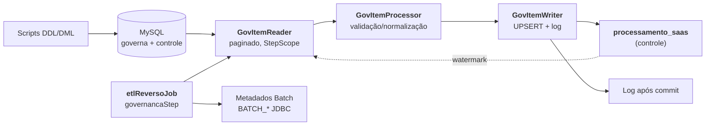
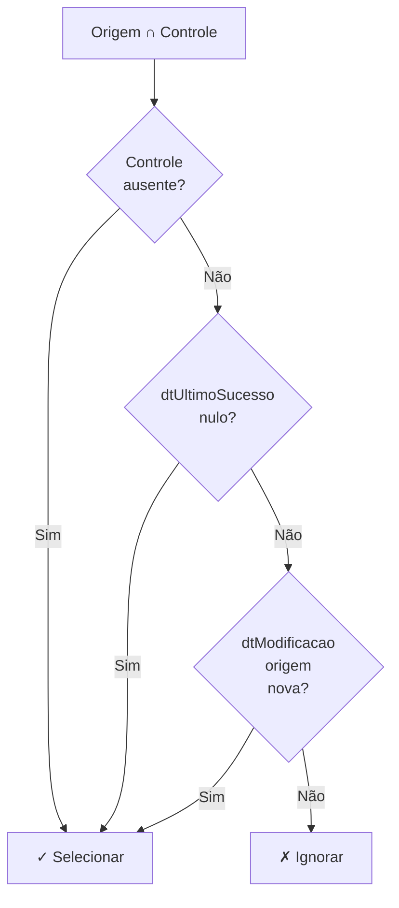
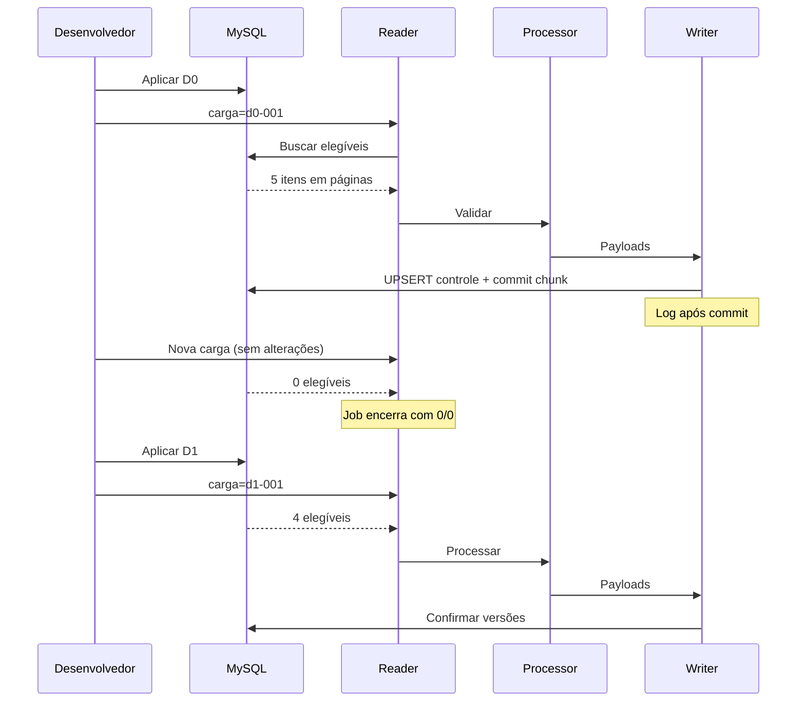

# ETL Reverso — Simulação Incremental com Spring Batch

POC local que simula um pipeline de ingestão reversa (governança → SaaS) com leitura paginada incremental, processamento com validação de contrato e escrita idempotente com controle transacional.

**Stack:** Java 21 · Spring Boot 4.1.1 · Spring Batch 6.0.5 · MySQL 8.4 · Maven · Docker Compose

> 🎯 **Escopo:** Não há BigQuery, framework de ingestão real nem chamadas HTTP externas. O writer **simula** o sucesso de um SaaS consumidor, registrando log e controle transacional local.

📋 Validação desta implementação: [docs/VALIDACAO.md](docs/VALIDACAO.md)

---

## Sumário

- [Visão geral](#visão-geral)
- [Pré-requisitos](#pré-requisitos)
- [Execução rápida](#execução-rápida)
- [Arquitetura e componentes](#arquitetura-e-componentes)
- [Regra incremental e datas](#regra-incremental-e-datas)
- [Transações, repetição e retomada](#transações-repetição-e-retomada)
- [Testes](#testes)
- [Volume e observabilidade](#volume-e-observabilidade)
- [Limpeza e reset do ambiente](#limpeza-e-reset-do-ambiente)
- [Governança de schema](#governança-de-schema)
- [Melhorias futuras](#melhorias-futuras)

---

## Visão geral

Este projeto demonstra um padrão robusto de ETL incremental usando **Spring Batch** em um contexto de sincronização de dados entre governança corporativa e SaaS externo.

### Problema que resolve

- ✅ Sincronizar dados incrementais sem perder atualizações
- ✅ Validar contratos de dados antes de processar
- ✅ Garantir idempotência (mesma entrada = mesmo resultado)
- ✅ Recuperar falhas sem duplicar processamento
- ✅ Auditoria completa com watermarks transacionais

### Características principais

| Característica | Implementação |
|---|---|
| **Leitura incremental** | `JdbcPagingItemReader` ordenado por PK, sem OFFSET |
| **Validação de contrato** | Record imutável `ServicoGovernancaProcessado` |
| **Idempotência** | UPSERT com watermark (`dtUltimoSucesso`) |
| **Transações** | JDBC + Spring Batch `DataSource` único |
| **Recuperação** | Retomada preserva checkpoint funcional (não posição) |

---

## Pré-requisitos

| Requisito | Detalhe |
|---|---|
| **JDK 21** | `JAVA_HOME` configurado |
| **Docker + Compose** | Ativo e acessível (`docker --version`, `docker compose --version`) |
| **Maven Wrapper** | Incluído — não requer Maven instalado globalmente |
| **Git** (opcional) | Para clonar o repositório |

✅ Todos os comandos abaixo executam a partir da **raiz do projeto**.

---

## Execução rápida

### 1. Subir o MySQL e aplicar DDL

```bash
docker compose up -d --wait
```

Esperar até `healthy`. O DDL de negócio é aplicado automaticamente no primeiro volume novo.

### 2. Build e testes

```bash
# Windows (PowerShell)
.\mvnw.cmd verify

# Linux/macOS (Bash)
./mvnw verify
```

Executa testes unitários + integração (Testcontainers).

### 3. Cenário pequeno (D0 + D1)

#### Windows (PowerShell)
```powershell
# Aplicar D0
.\scripts\sql.ps1 D0
java -jar target/etl-reverso-0.0.1-SNAPSHOT.jar carga=d0-001

# Repetir D0 (sem mudanças — contadores 0/0 esperados)
java -jar target/etl-reverso-0.0.1-SNAPSHOT.jar carga=d0-repeticao-001

# Aplicar D1
.\scripts\sql.ps1 D1
java -jar target/etl-reverso-0.0.1-SNAPSHOT.jar carga=d1-001

# Repetir D1 (sem mudanças — contadores 0/0 esperados)
java -jar target/etl-reverso-0.0.1-SNAPSHOT.jar carga=d1-repeticao-001

# Validar resultado
.\scripts\sql.ps1 Validate
```

#### Linux/macOS (Bash)
```bash
# Aplicar D0
docker compose exec -T mysql mysql -ubatch -pbatch etl_reverso < src/main/resources/mysql/dml/01-d0.sql
java -jar target/etl-reverso-0.0.1-SNAPSHOT.jar carga=d0-001

# Repetir D0
java -jar target/etl-reverso-0.0.1-SNAPSHOT.jar carga=d0-repeticao-001

# Aplicar D1
docker compose exec -T mysql mysql -ubatch -pbatch etl_reverso < src/main/resources/mysql/dml/02-d1.sql
java -jar target/etl-reverso-0.0.1-SNAPSHOT.jar carga=d1-001

# Repetir D1
java -jar target/etl-reverso-0.0.1-SNAPSHOT.jar carga=d1-repeticao-001

# Validar
docker compose exec -T mysql mysql -ubatch -pbatch etl_reverso < src/main/resources/mysql/04-validacao.sql
```

> 📌 **Roadmap:** Um runner `.sh` equivalente ao `sql.ps1` melhoraria a paridade entre plataformas (ver [Melhorias futuras](#melhoriasuturas)).

### Resultado esperado

| Execução | readCount | writeCount | Descrição |
|---|---|---|---|
| **D0** (carga inicial) | 5 | 5 | 5 serviços novos |
| **D0 repetição** | 0 | 0 | Sem mudanças — elegibilidade nula |
| **D1** (misto) | 4 | 4 | Serviços 002, 004, 006, 007 (novos ou alterados) |
| **D1 repetição** | 0 | 0 | Sem mudanças — elegibilidade nula |

**Resultado físico:**
- **7 registros** totais na origem (`servico_governanca`)
- **7 registros** totais no controle (`processamento_saas`)
- Serviços `002` e `004` têm **2 tentativas** confirmadas; demais têm 1

---

## Arquitetura e componentes

### Fluxo de dados



### Componentes principais

#### `EtlReversoConfiguration`

Define o `Job`, `Step` e beans da pipeline. Valida parâmetro `carga` via `EtlReversoJobParametersValidator`.

- ⚠️ `ServicoGovernancaItemReader` implementa `StepExecutionListener` para emitir log de resumo (`SIMULACAO_RESUMO`) → exige `.listener(reader)` explícito na config.

#### `GovItemReader`

`JdbcPagingItemReader` com `@StepScope`:

- **Paginação por PK crescente** (`cdServicoGovernanca`), não por `OFFSET` — essencial para incrementalidade
- `saveState=false` intencional: checkpoint funcional = watermark transacional, não posição
- **Seleciona elegíveis em SQL** com `LEFT JOIN` + `OR` (sem filtro adicional no processor)
- Acumula `pageQueries` e `queryNanos` em `ExecutionContext` para diagnóstico

**Elegibilidade:**
```sql
SELECT s.cdServicoGovernanca, s.cdServicoOrigem, s.dsNomeProduto, s.dsStatus, s.dtModificacao
  FROM servico_governanca s
  LEFT JOIN processamento_saas p ON p.cdServicoOrigem = s.cdServicoOrigem
 WHERE (p.cdServicoOrigem IS NULL
     OR p.dtUltimoSucesso IS NULL
     OR s.dtModificacao > p.dtUltimoSucesso)
 ORDER BY s.cdServicoGovernanca;
```

#### `GovItemProcessor`

Stateless, sem `@StepScope`. Valida e normaliza cada item:

- Identidade técnica (`cdServicoOrigem`) obrigatória, UUID em minúsculas canônicas
- `dtModificacao` obrigatória
- `dsNomeProduto` obrigatório, ≤ 255 caracteres, sem espaços nas pontas
- `dsStatus` normalizado para `ATIVO`/`INATIVO` (Locale.ROOT)
- **Sem retry/skip**: qualquer violação falha o job inteiro (fail-fast intencional)

#### `GovItemWriter`

Batch JDBC `INSERT ... ON DUPLICATE KEY UPDATE` (UPSERT) na tabela de controle, com log **após commit** via `TransactionSynchronization.afterCommit()`.

- **Sem requisição HTTP real** — simula sucesso em SaaS
- Grava `dtUltimoSucesso` com versão lida (`item.dtModificacao()`), nunca relógio local
- Exige transação JDBC ativa (`TransactionSynchronizationManager.isActualTransactionActive()`)
- Log por item em `debug`; resumo por chunk em `info`

#### `ServicoGovernanca` e `ServicoGovernancaProcessado`

Records imutáveis:
- `ServicoGovernanca` — origem crua
- `ServicoGovernancaProcessado` — payload validado/normalizado

#### Schema (`src/main/resources/mysql`)

```
mysql/
├── ddl/00-schema.sql                   ← Criação de tabelas
├── dml/
│   ├── 01-d0.sql                        ← Cenário D0 (5 serviços)
│   ├── 02-d1.sql                        ← Cenário D1 (misto)
│   └── 03-idempotencia.sql              ← Testes de repetição
├── volume/
│   ├── 10-volume-d0.sql                 ← 50.000 serviços
│   └── 11-volume-d1.sql                 ← +5.000 novos, +1.200 alterados
├── 04-validacao.sql                     ← Queries de auditoria
├── 05-explain.sql                       ← Planos de execução
└── 99-cleanup.sql                       ← Limpeza de negócio
```

---

## Regra incremental e datas

### Elegibilidade

Um item é lido se **qualquer** condição for verdadeira:

1. Controle ausente (`cdServicoOrigem` não existe em `processamento_saas`)
2. Última tentativa nula (`dtUltimoSucesso` é NULL)
3. Origem foi alterada (`s.dtModificacao > p.dtUltimoSucesso`)



### Semântica de datas

| Coluna | Semântica | Gerida por |
|---|---|---|
| `dtUltimoSucesso` | Watermark de versão lida/processada | Aplicação (payload) |
| `dtUltimoProcessamento` | Auditoria da tentativa (relógio) | MySQL `CURRENT_TIMESTAMP(6)` |
| `dtCriacao` / `dtAtualizacao` | Metadadas técnicas | MySQL |
| `dtModificacao` (origem) | **Nunca** usa `ON UPDATE` — apenas datas técnicas | Fixture/origem |

> ⚠️ **Erro comum:** usar `NOW()` em ambos os campos. Se o relógio local se tornasse watermark, alterações posteriores seriam ignoradas ou duplicadas.

### Convenções

- Todas as datas: `DATETIME(6)` em **UTC** (URL JDBC + Compose configuram sessão)
- Sem fuso embutido nos valores
- `page-size` e `chunk-size` configuráveis (testes usam 3 e 2 para exercitar múltiplas páginas)

---

## Transações, repetição e retomada

### Ciclo de vida por execução



### Comportamento de `carga` (parâmetro obrigatório)

| Cenário | Comportamento |
|---|---|
| **Nova execução, sem mudanças de dado** | Usar `carga` novo → contadores 0/0 |
| **Repetir parâmetros de instância `COMPLETED`** | ❌ Rejeitado pelo Spring Batch antes da leitura |
| **Retomar instância `FAILED`** | Repetir o **mesmo** `carga` → preserva identidade |

### Checkpoint e retomada

- **Sem `saveState`:** checkpoint funcional = watermark transacional, **não** posição de leitura
- Restart recomeça pela **primeira elegibilidade não confirmada**
- Metadados (`BATCH_*`) persistem em MySQL
- **Controle (`processamento_saas`) é fonte de verdade**, não logs

> ⚠️ Executar **uma instância por vez**. A POC não implementa claim/lease para jobs concorrentes com `carga` diferentes.

---

## Testes

### Executar testes

```bash
# Windows
.\mvnw.cmd test      # unidades do processor
.\mvnw.cmd verify     # + integração (Testcontainers)

# Linux/macOS
./mvnw test
./mvnw verify
```

### Cobertura (Testcontainers)

`verify` sobe MySQL 8.4 em porta aleatória **sem** reutilizar volume local:

- ✅ D0 completo, chaves estáveis, D1 misto
- ✅ Somente novos, somente alterados
- ✅ Repetição (idempotência), `dtUltimoSucesso` nulo
- ✅ Data antiga vs. técnica
- ✅ Múltiplas páginas, falha/retomada
- ✅ Rollback JDBC, mudança de origem "em voo"
- ✅ Governança de tipos, cleanup
- ✅ Validação de parâmetros, EXPLAIN

**Resultado:** Contagens + plano de execução em `target/volume-result.txt`

> 📢 Docker indisponível **falha** a integração — não é silenciosamente pulada.

> 📋 `.github/workflows/verify.yml` está pronto para rodar em Java 21 quando hospedado no GitHub.

---

## Volume e observabilidade

### Cenário de volume (50.000 → 55.000 registros)

```powershell
# Windows
.\scripts\sql.ps1 Cleanup
.\scripts\sql.ps1 VolumeD0
java -jar target/etl-reverso-0.0.1-SNAPSHOT.jar carga=volume-d0-001 `
  --logging.level.br.com.murilohenzo.batch.etl.reverso.batch.writer=WARN

.\scripts\sql.ps1 VolumeD1
java -jar target/etl-reverso-0.0.1-SNAPSHOT.jar carga=volume-d1-001 `
  --logging.level.br.com.murilohenzo.batch.etl.reverso.batch.writer=WARN
```

| Cenário | readCount | writeCount | Resultado |
|---|---|---|---|
| **VolumeD0** | 50.000 | 50.000 | 50 mil serviços novos |
| **VolumeD1** | 6.200 | 6.200 | 5 mil novos + 1.200 alterados |
| **VolumeD1 repetido** | 0 | 0 | Sem mudanças |
| **Total físico** | — | — | 55.000 registros |

### Propriedades customizáveis

```bash
java -jar target/etl-reverso-0.0.1-SNAPSHOT.jar \
  carga=volume-d0-001 \
  --simulacao.page-size=1000 \
  --simulacao.chunk-size=1000
```

### Métricas emitidas (`SIMULACAO_RESUMO`)

| Métrica | Significado |
|---|---|
| `readCount` / `writeCount` / `filterCount` | Contadores oficiais do `StepExecution` |
| `pageQueries` | Nº de queries ao banco (inclui terminal vazia) |
| `pageSize` | Tamanho de página configurado |
| `queryMs` | JDBC + transporte + mapeamento (não é apenas servidor) |
| `durationMs` | Duração total do step |

Também persistido em `ExecutionContext`: `reader.pageQueries`, `reader.queryNanos`.

> 💡 **Observação:** Baixo `readCount` não implica custo de SQL proporcional — `LEFT JOIN` + `OR` pode examinar grande parte da tabela por página.

### Outras fontes de telemetria

- `docker stats` — CPU/memória do container MySQL
- Tabelas `BATCH_STEP_EXECUTION` / `BATCH_JOB_EXECUTION` — durações e commits oficiais

---

## Limpeza e reset do ambiente

### Limpar apenas dados de negócio

```powershell
.\scripts\sql.ps1 Cleanup
```

Executa com batch **parado**. Apaga apenas `servico_governanca` e `processamento_saas` em transação, respeitando FKs. Mantém metadados do Batch e `AUTO_INCREMENT`.

### Reset completo (metadados + auto-increment)

```bash
docker compose down -v
docker compose up -d --wait
```

Remove volume Docker. Aplicação **não** executa limpeza automaticamente.

> ⚠️ Nunca aplicar D1 sobre D0 para simular "nova mudança" — DML pequeno é **sequência fixa**, não política de evento.

---

## Governança de schema

| Convenção | Regra |
|---|---|
| **Tabelas** | `snake_case` |
| **Colunas** | `lowerCamelCase` |
| **Prefixos** | `cd` (código/PK), `ds` (descrição), `dt` (data), `qt` (quantidade) |
| **`cdServicoGovernanca`** | PK técnica `BIGINT UNSIGNED` |
| **`cdServicoOrigem`** | UUID textual `CHAR(36)`, `UNIQUE` origem + controle, FK entre elas |
| **`qtTentativas`** | `INT UNSIGNED` |
| **`dtModificacao`** | Sem `ON UPDATE` — apenas datas técnicas geridas por MySQL |

Todos os nomes legados (`id`, `cdServico`, `nome`, `status`) foram substituídos pelos nomes governados.

---

## Melhorias futuras

### Performance e vazão

- **Paralelizar a leitura (partitioning de Step)** — `governancaStep` é single-threaded hoje. Pré-requisito: usar `AtomicLong` nos contadores do reader.
- **Otimizar o predicado incremental** — Revisar `LEFT JOIN` + `OR` com índices compostos; `readCount` baixo não implica custo SQL baixo.
- **`chunk-size`/`page-size` adaptativos** — Hoje são fixos; poderiam ser dinâmicos (ex.: baseados em `Runtime.availableProcessors()`).
- **Writer em batch maior que chunk** — Agrupar múltiplos chunks antes de commitar, se volume de UPSERTs crescer.

### Resiliência

- **Política de skip/retry configurável** — Hoje qualquer erro no processor derruba o job (fail-fast intencional). Em produção, valeria um `failWithNoRollback()`.
- **Claim/lease para execuções concorrentes** — POC assume serial; suportar múltiplos jobs exigiria mecanismo de lease por partição.

### Observabilidade

- **Micrometer/Actuator** em vez de (ou além de) logs `SIMULACAO_*` — exporíam métricas como séries temporais.
- **Runner Bash** equivalente ao `sql.ps1` — paridade real entre Windows e Linux/macOS.

### Schema e migração

- **Adotar Flyway ou Liquibase** — histórico de migrações versionado e rollback controlado, em vez de inicialização SQL idempotente.

---

## Licença

Apache License 2.0 — veja [LICENSE](LICENSE).

## Contato

Autor: [@murilohenzo](https://github.com/murilohenzo)  
Repositório: [murilohenzo/spring-batch-etl-reverso](https://github.com/murilohenzo/spring-batch-etl-reverso)
